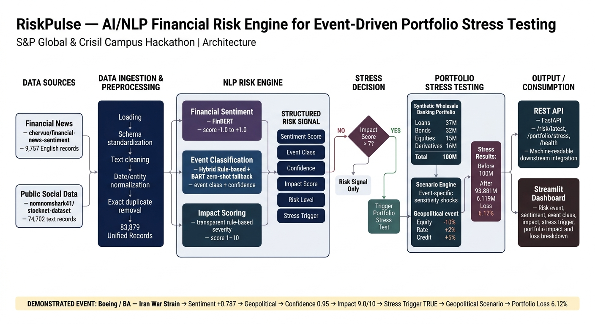

# RiskPulse - S&P Global & Crisil Campus Hackathon

**Candidate Name:** Payal Sulaniya  
**College Email ID:** payal103bteceai24@igdtuw.ac.in  
**College:** Indira Gandhi Delhi Technical University for Women (IGDTUW)  
**Demo Video Link:** [YouTube / Unlisted Link]  
**Slide Deck Link (if hosted externally):** [View Presentation](https://canva.link/0vbsgatitt472kf)

---

## 1. Problem Statement & Approach

Financial institutions receive large volumes of unstructured information through sources such as financial news and public social-media posts. Identifying financially relevant events from this information and translating them into actionable risk signals can be difficult because the information is diverse, noisy, and not directly structured for downstream risk analysis.

**RiskPulse** is an AI/NLP-based financial risk engine that converts unstructured financial text into structured risk signals. The system processes financial news and historical public social-media text, performs financial sentiment analysis using FinBERT, classifies the type of financial event using a hybrid rule-based and zero-shot approach, and assigns a transparent impact score from 1 to 10. Events with an impact score above the configured threshold trigger a strategic portfolio stress test.

The prototype implements the downstream **Strategic, Event-Driven Portfolio Stress Testing** use case. A synthetic wholesale banking portfolio containing loans, bonds, equities, and derivatives is subjected to simplified scenario-based shocks corresponding to the detected high-impact event. The resulting risk signal and portfolio stress results are exposed through a REST API and presented through a Streamlit dashboard.

> **Scope:** The current prototype uses historical public datasets for reproducibility. It does not claim live or streaming data ingestion. The portfolio and stress scenarios are synthetic and simplified for demonstration purposes.

---

## 2. Architecture & Tech Stack

### System Architecture



### Data Flow

```text
Financial News + Social Media
              |
              v
       Data Ingestion
              |
              v
        Preprocessing
              |
              v
        NLP Risk Engine
        /      |       \
       /       |        \
Sentiment    Event      Impact
 Score      Class       Score
       \       |        /
        \      |       /
         v     v      v
       Structured Risk Signal
              |
              v
           REST API
              |
              v
    Portfolio Stress Testing
              |
              v
          Dashboard
```

## 2. Technology Stack
 
| Layer | Technology |
|---|---|
| Language | Python |
| Data Processing | Pandas |
| NLP / Machine Learning | Hugging Face Transformers |
| Sentiment Model | FinBERT (`ProsusAI/finbert`) for financial sentiment analysis |
| Event Classification Fallback | BART (`facebook/bart-large-mnli`) for zero-shot event classification |
| API | FastAPI |
| API Server | Uvicorn |
| Dashboard | Streamlit |
| Deep Learning Runtime | PyTorch |
| Data Sources | Public Hugging Face datasets |
| Version Control | Git / GitHub |
 
### Core Modules
 
| Module | Purpose |
|---|---|
| `src/ingestion.py` | Loads, standardizes, cleans, and combines the input datasets |
| `src/sentiment.py` | Performs financial sentiment analysis using FinBERT |
| `src/event_classifier.py` | Performs hybrid event classification |
| `src/impact_score.py` | Calculates the transparent 1–10 event impact score |
| `src/risk_engine.py` | Connects sentiment, event classification, and impact scoring |
| `src/portfolio_stress.py` | Applies event-specific stress scenarios to the synthetic portfolio |
| `src/integrated_risk_pipeline.py` | Runs the complete end-to-end risk pipeline |
| `src/api.py` | Exposes machine-readable risk and stress-test results |
| `dashboard.py` | Provides the Streamlit decision-support dashboard |
 
## 3. Dataset Used
 
RiskPulse uses publicly available historical datasets. No confidential or proprietary financial data is used.
 
### Financial News Dataset
 
**Dataset:** `cheruvo/financial-news-sentiment`
 
**Source:** <https://huggingface.co/datasets/cheruvo/financial-news-sentiment>
 
The dataset contains financial news information including:
 
- Ticker
- Publication date
- Source
- Headline
- URL
- Reference sentiment
The English records were extracted and converted into the project's common input schema.
 
After preprocessing and removal of exact duplicate observations, the project contains:-
**9,177 financial-news records**
The original reference sentiment field is retained as dataset metadata and is not used as the RiskPulse sentiment prediction.
 
### Social-Media Dataset

**Dataset:** `nomnomshark41/stocknet-dataset`
 
**Source:** <https://huggingface.co/datasets/nomnomshark41/stocknet-dataset>
 
The dataset contains historical stock-related social-media text associated with stock-day records.
 
For the RiskPulse NLP pipeline, the textual information is used as social-media input. Stock movement labels, prices, trading volume, and other market prediction fields are not used as NLP inputs.
 
The processed dataset contains:-
**74,702 individual social-media text records**
The source dataset provides stock-day dates rather than exact timestamps for individual posts. The implementation therefore uses the available date information and does not assign artificial tweet-level timestamps.
 
### Combined Dataset
 
| Dataset | Processed Records |
|---|---:|
| Financial News | 9,177 |
| Social Media | 74,702 |
| **Total** | **83,879** |
 
### Data Assumptions
 
- Historical public data is used to provide a reproducible demonstration.
- Financial news headlines and social-media text are treated as unstructured textual inputs.
- Exact duplicate observations are removed during preprocessing.
- Social-media records use the date supplied by the source dataset.
- The portfolio used for stress testing is synthetic.
- Portfolio sensitivities and scenario shocks are simplified assumptions for the prototype.
## 4. Quickstart & Installation
 
**Runtime:** Python 3.10+
 
**OS Tested:** Windows 11
 
**Environment:** Python virtual environment (`.venv`)
 
### Clone the Repository
 
```bash
git clone <https://github.com/Payal12-max/IGDTUW-Payal-Sulaniya-Hackathon.git>
cd IGDTUW-Payal-Sulaniya-Hackathon
```
 
### Create a Virtual Environment
 
**Windows**
 
```bash
python -m venv .venv
.venv\Scripts\activate
```
 
**macOS / Linux**
 
```bash
python3 -m venv .venv
source .venv/bin/activate
```
 
### Install Dependencies
 
```bash
pip install -r requirements.txt
```
 
### Run the Integrated Risk Pipeline
 
```bash
python src/integrated_risk_pipeline.py
```
 
This runs the complete risk-analysis workflow:
 
```text
Input Data
    ↓
Preprocessing
    ↓
Sentiment Analysis
    ↓
Event Classification
    ↓
Impact Scoring
    ↓
Stress Trigger
    ↓
Portfolio Stress Test
```
 
The resulting integrated risk output is saved to:
 
```text
data/integrated_risk_results.csv
```
 
### Start the REST API
 
```bash
uvicorn src.api:app --reload
```
 
The API will be available at:
 
```text
http://127.0.0.1:8000
```
 
Interactive API documentation:
 
```text
http://127.0.0.1:8000/docs
```
 
### Available API Endpoints
 
**Health Check**
 
```http
GET /health
```
 
**Latest Risk Signal**
 
```http
GET /risk/latest
```
 
Returns structured information including:
 
- Sentiment
- Sentiment score
- Event class
- Event confidence
- Classification method
- Impact score
- Risk level
- Stress trigger
**Portfolio Stress**
 
```http
GET /portfolio/stress
```
 
Returns:
 
- Portfolio value before stress
- Portfolio value after stress
- Portfolio loss
- Portfolio loss percentage
- Stress scenario
- Position-level stress results
### Start the Dashboard
 
In a separate terminal:
 
```bash
streamlit run dashboard.py
```
 
The Streamlit dashboard provides a visual representation of the detected risk event and resulting portfolio stress.
 
## 5. Key Results & Domain Impact
 
### Risk Signal Output
 
For each analyzed text record, RiskPulse generates:
 
- **Sentiment Score:** -1.0 to +1.0
- **Event Class:** Financial event category
- **Event Confidence:** Classification confidence
- **Impact Score:** 1–10 severity score
- **Risk Level:** Low / Moderate / High / Critical
- **Stress Trigger:** Whether the event crosses the configured threshold
### Event Categories
 
The current event classifier supports:
 
- Geopolitical
- Macroeconomic
- Credit Event
- Merger & Acquisition
- Product Launch
- Regulatory
- Financial Results
### Event Classification Validation
 
A curated validation set containing 30 financial headlines was used to evaluate the event classifier.
 
- Correct classifications: **25 / 30**
- Validation accuracy: **83.33%**
This result applies specifically to the project's curated 30-headline validation set and is not presented as a general benchmark for financial event classification.
 
### Demonstration Event
 
The integrated demonstration uses the following historical financial-news event:
 
> "Pentagon Urges Boeing (NYSE: BA), Lockheed (NYSE: LMT) And RTX (NYSE: RTX) To Fast-Track Weapons Output Amid Iran War Strain"
 
The resulting risk signal is:
 
| Signal | Result |
|---|---|
| Entity | BA |
| Sentiment Score | +0.787 |
| Event Class | Geopolitical |
| Classification Method | Rule |
| Event Confidence | 0.95 |
| Impact Score | 9.0 / 10 |
| Risk Level | Critical |
| Stress Trigger | True |
 
The event crosses the configured stress threshold:
 
```text
Impact Score > 7
```
 
and therefore triggers the geopolitical portfolio stress scenario.
 
### Portfolio Stress Result
 
The synthetic portfolio has a total value of:
 
**100,000,000**
 
Under the geopolitical stress scenario:
 
```text
Equity Shock: -10%
Rate Shock:   +2%
Credit Shock: +5%
```
 
the prototype produces:
 
```text
Portfolio Value Before: 100,000,000
Portfolio Value After:   93,881,000
Portfolio Loss:           6,119,000
Portfolio Loss Percentage:    6.12%
```
 
The dashboard additionally shows the distribution of losses across:
 
- Asset classes
- Sectors
- Individual portfolio positions
### Domain Impact
 
The prototype demonstrates how unstructured information can be transformed into a structured financial risk signal and connected to a downstream portfolio analysis workflow.
 
From a financial-risk perspective, the workflow can help illustrate:
 
```text
Unstructured Information
          ↓
Event Identification
          ↓
Risk Quantification
          ↓
Stress Trigger
          ↓
Portfolio Impact
```
 
This creates a bridge between qualitative information analysis and quantitative portfolio stress assessment.
 
The API layer also allows the generated risk signals to be consumed programmatically by downstream applications rather than being limited to dashboard visualization.
 
## 6. Portfolio Stress-Testing Methodology
 
The prototype uses a synthetic wholesale banking portfolio containing:
 
| Asset Type | Positions | Portfolio Value |
|---|---:|---:|
| Loans | 3 | 37,000,000 |
| Bonds | 2 | 32,000,000 |
| Equities | 2 | 15,000,000 |
| Derivatives | 2 | 16,000,000 |
| **Total** | **9** | **100,000,000** |
 
Each position has simplified sensitivities to:
 
- Equity movements
- Interest-rate movements
- Credit conditions
The stress engine applies predefined scenario shocks according to the detected event class.
 
The current prototype supports stress scenarios for:
 
- Geopolitical events
- Macroeconomic events
- Credit events
- Regulatory events
The stress calculation is intended to demonstrate the strategic impact of major events on a synthetic portfolio.
 
## 7. Impact-Scoring Methodology
 
The impact score is a transparent prototype severity measure ranging from 1 to 10.
 
Base event scores are defined according to event category:
 
| Event Class | Base Impact |
|---|---:|
| Geopolitical | 7.0 |
| Macroeconomic | 6.0 |
| Credit Event | 8.0 |
| Merger & Acquisition | 5.0 |
| Product Launch | 3.0 |
| Regulatory | 6.0 |
| Earnings / Financial Results | 5.0 |
| Unclassified | 0.0 |
 
Additional adjustments can be applied based on:
 
- Sentiment severity
- Default/bankruptcy terminology
- War/invasion terminology
- Sanctions
- Fraud
- Downgrades
- Major losses
- Other predefined high-severity terms
The final classified-event score is constrained to the 1–10 range.
 
The current impact score is a transparent rule-based severity measure. It is not a trained prediction of actual monetary loss, probability of default, Value at Risk, Expected Shortfall, or regulatory capital.
 
## 8. Repository Structure
 
```text
IGDTUW-Payal-Sulaniya-Hackathon/
│
├── README.md
├── requirements.txt
├── LICENSE
├── .gitignore
│
├── dashboard.py
│
├── src/
│   ├── ingestion.py
│   ├── sentiment.py
│   ├── event_classifier.py
│   ├── impact_score.py
│   ├── risk_engine.py
│   ├── portfolio_stress.py
│   ├── integrated_risk_pipeline.py
│   ├── find_demo_events.py
│   ├── evaluate_event_classifier.py
│   └── api.py
│
├── data/
│   ├── news.csv
│   ├── social_media.csv
│   ├── event_validation.csv
│   ├── event_validation_results.csv
│   ├── portfolio.csv
│   └── integrated_risk_results.csv
│
└── docs/
    ├── architecture.png
    └── presentation.pdf
```
 
## 9. Limitations & Scope
 
- The current implementation uses historical public datasets rather than a live streaming ingestion system.
- The social-media dataset provides stock-day dates rather than exact timestamps for individual posts.
- The portfolio used in the demonstration is synthetic.
- Portfolio stress calculations use simplified scenario-based sensitivity assumptions.
- The prototype does not perform full instrument valuation or regulatory capital modelling.
- The impact score is a transparent rule-based severity measure rather than a trained loss-prediction model.
- The event-classification validation result is based on a small curated validation set of 30 headlines.
- The prototype is intended for demonstration and decision-support purposes and is not a production banking risk-management system.
## 10. Future Extensions
 
Potential future extensions include:
 
- Live financial-news ingestion
- Streaming social-media ingestion
- Cross-source event deduplication
- Entity resolution
- Multilingual financial NLP
- Event clustering
- Historical risk backtesting
- Market-data integration
- Portfolio-specific exposure mapping
- Probabilistic impact modelling
- More detailed derivative valuation
- Scenario comparison and alerting
These are potential extensions and are not represented as currently implemented functionality.
 
## 11. AI Assistance Disclosure
 
AI-assisted development tools were used during development for activities including code generation, debugging, documentation support, and technical assistance.
 
The submitted implementation, outputs, assumptions, and limitations were reviewed and tested in the project's local environment.
 
## 12. License
 
This project is released under the MIT License.
 
See [LICENSE](LICENSE) for the full license text.
 
## 13. Hackathon Submission
 
**Hackathon:** S&P Global & Crisil Campus Hackathon 2026
 
**Project:** RiskPulse - AI/NLP Financial Risk Engine for Event-Driven Portfolio Stress Testing
 
**Candidate:** Payal Sulaniya
 
**College:** Indira Gandhi Delhi Technical University for Women (IGDTUW)
 
**Demo Video:** [Add final demo video link]
 
**Slide Deck:** [Add slide deck link if hosted externally]
